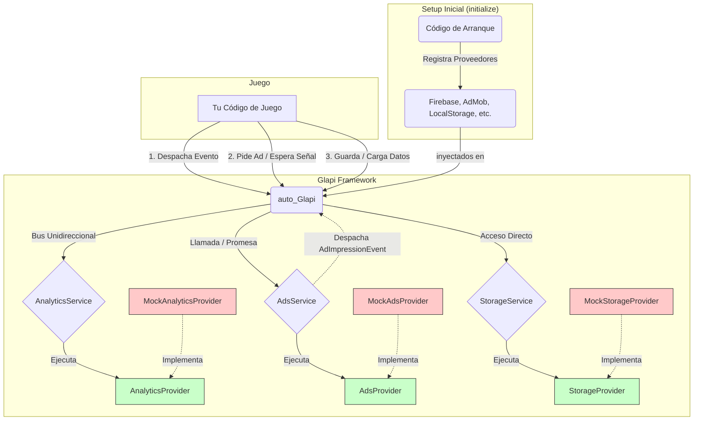

# Glapi Framework

**Glapi** es un framework modular y desacoplado para Godot 4.x, diseñado para abstraer la comunicación con servicios de terceros como analíticas, anuncios (ads) y almacenamiento. 

Su **arquitectura híbrida** combina el patrón de **Inyección de Dependencias**, un **Bus de Eventos** para telemetría, y **Llamadas Asíncronas (`await`)** para interrupciones de UI, lo que permite un código de juego limpio, natural, testeable y agnóstico a los SDKs específicos que se utilicen.

## Visión General de la Arquitectura

El framework se compone de tres conceptos clave: **Servicios**, **Proveedores** y **Eventos**.

- **Servicio (`Service`):** Es una clase que define una capacidad del framework (ej. `AdsService`). Maneja la lógica de negocio y decide cómo interactuar con el juego (mediante eventos globales, señales o llamadas directas).
- **Proveedor (`Provider`):** Es el "brazo ejecutor" de un servicio. Contiene la implementación real que se comunica con un SDK de terceros (ej. `FirebaseProvider`, `AdMobProvider`).
- **Evento (`Event`):** Objeto ligero de telemetría (ej. `LevelCompletedEvent`) que viaja por el bus central de forma *Fire-and-Forget*, destinado principalmente a la Analítica.



## Características

- **Desacoplado:** Tu juego no sabe si usas Firebase o un Mock. El código de tus mecánicas se mantiene puro.
- **Flujo Natural (Godot 4):** Usa `await` para pausar rutinas mientras se muestran anuncios recompensados, sin anidar callbacks complejos.
- **Testeable:** Incluye `MockProviders` funcionales. Tu juego puede correr en el editor simulando tiempos de carga de anuncios y guardado en RAM sin necesidad de instalar SDKs de Android.
- **Centralizado:** El autoload `auto_Glapi` actúa como el único punto de entrada.

---
## Instalación

Glapi funciona como un **Plugin** de Godot, por lo que sus archivos deben residir estrictamente dentro de la carpeta `addons` de tu proyecto. Tienes dos opciones para añadirlo:

### Opción A: Git Submodule (Recomendado)
Si tu proyecto usa Git, la forma más limpia es añadir Glapi como un submódulo. Abre una terminal en la raíz de tu proyecto y ejecuta:
```bash
# Crea la carpeta addons si tu proyecto aún no la tiene
mkdir addons

# Añade el submódulo directamente en la ruta correcta
git submodule add https://github.com/SrColoma/Glapi-framework.git addons/glapi
```

### Opción B: Copia Manual
1.  Descarga este repositorio como un archivo ZIP desde GitHub.
2.  Descomprime el archivo.
3.  Crea una carpeta llamada `addons` en la raíz de tu proyecto de Godot (si no existe ya).
4.  Copia la carpeta del framework dentro de `addons` y renómbrala a `glapi` (la ruta final debe ser `res://addons/glapi/`).

### Activación del Plugin
Una vez que los archivos estén en su lugar, debes decirle a Godot que active el framework:
1. Abre tu proyecto en el editor de Godot.
2. Ve al menú superior: **Proyecto -> Configuración del proyecto -> Pestaña "Plugins"**.
3. Busca **Glapi Framework** en la lista y marca la casilla **Activar**.
4. ¡Listo! Godot inyectará automáticamente el Autoload `Glapi` en tu proyecto.

---

## ¿Cómo Empezar?

### 1. Configuración (Composition Root)

En tu escena principal (o script de arranque), llama a `initialize()` para inyectar los proveedores que usarás en producción. Si omites uno, Glapi usará su `MockProvider` automáticamente.

```gdscript
func _ready() -> void:
	# En desarrollo/PC, esto usará los Mocks automáticamente si los dejamos en null.
	# En producción (Android), inyectaríamos aquí los providers reales.
	auto_Glapi.initialize(
		# ads_prov = AdMobProvider.new(),
		# analytics_prov = FirebaseProvider.new()
	)
```

### 2. Analítica (Patrón Fire-and-Forget)

La analítica usa el Bus de Eventos. Cuando ocurra algo relevante, despacha un evento y olvídate. No interrumpe el juego.

```gdscript
func _die() -> void:
	# ...lógica de muerte...
	
	# Lo lanzamos al bus. El AnalyticsService lo atrapará y lo enviará al Provider.
	auto_Glapi.dispatch(VirtualCurrencySpentEvent.new("revive_potion", 1))
```

También puedes actualizar el estado del usuario directamente:
```gdscript
auto_Glapi.analytics.set_user_property("player_class", "brawler")
```

### 3. Anuncios (Asíncrono con `await`)

Los anuncios interrumpen la UI. Usa las señales expuestas en `auto_Glapi.ads` junto con la palabra clave `await` para un flujo secuencial perfecto.

```gdscript
func _on_revive_button_pressed() -> void:
	get_tree().paused = true # Pausar el juego
	
	# Solicitar el anuncio
	auto_Glapi.ads.show_ad("rewarded")
	
	# Esperar a que el usuario cierre el anuncio
	await auto_Glapi.ads.ad_closed
	
	# (Opcional: escuchar a la señal ad_rewarded para dar el premio)
	
	get_tree().paused = false # Reanudar el juego
```
*(Nota: El framework automáticamente despachará eventos de analítica de impresiones (eCPM) en segundo plano cuando se muestren anuncios, sin que tengas que programarlo aquí).*

### 4. Almacenamiento (Acceso Directo)

El módulo de guardado expone métodos directos para guardar y recuperar información de configuración o progreso.

```gdscript
# Para Guardar
var config = {"sound": true, "music_volume": 0.8}
auto_Glapi.storage.save_data("settings", config)

# Para Cargar
var loaded_config = auto_Glapi.storage.load_data("settings")
```

---

## ¿Cómo Extender Glapi?

### Crear un Nuevo Proveedor (Ej. AdMob)

Para integrar un nuevo SDK, debes crear un `Provider` que actúe como adaptador.

1.  **Crea el Script:** Por ejemplo `admob_provider.gd`.
2.  **Extiende la Clase Base:** Haz que herede del Provider correspondiente (`AdsProvider`).
3.  **Implementa los Métodos y Emite Señales:** Conecta las funciones del SDK de AdMob a las señales que espera el framework.

**Ejemplo:**
```gdscript
class_name AdMobProvider extends AdsProvider

func initialize() -> void:
	# AdMob.initialize()
	print("🟢 AdMob inicializado.")

func show_ad(format: AdFormat) -> void:
	# AdMob.show_rewarded_video()
	# Cuando el SDK termine, asegúrate de emitir:
	# ad_closed.emit(format)
	pass
```

### Crear un Nuevo Evento de Analítica

1.  **Crea el Script:** Por ejemplo, `boss_defeated_event.gd`.
2.  **Extiende `GlapiEvent`:**
3.  **Implementa `to_dict()`:** Crucial para enviar los parámetros a tu backend.

```gdscript
class_name BossDefeatedEvent extends GlapiEvent

var boss_name: String
var time_taken: float

func _init(_boss_name: String, _time_taken: float) -> void:
	self.event_name = "boss_defeated"
	self.boss_name = _boss_name
	self.time_taken = _time_taken

func to_dict() -> Dictionary:
	return {
		"boss_name": boss_name,
		"time_taken": time_taken
	}
```
