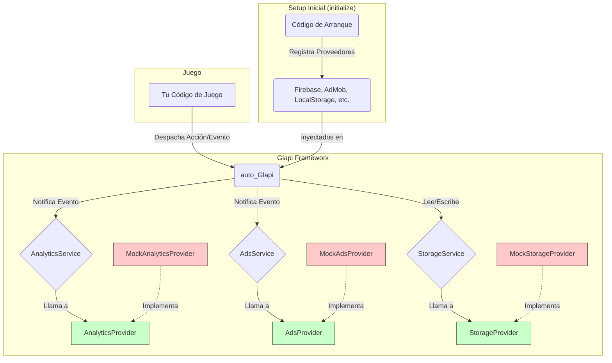

# Glapi Framework

**Glapi** es un framework modular y desacoplado para Godot 4.x, diseñado para abstraer la comunicación con servicios de terceros como analíticas, anuncios (ads) y almacenamiento. Su arquitectura se basa en un patrón de **Inyección de Dependencias** y un **Bus de Eventos**, lo que permite un código de juego limpio, testeable y agnóstico a los SDKs específicos que se utilicen.

## Visión General de la Arquitectura

El framework se compone de tres conceptos clave: **Servicios**, **Proveedores** y **Eventos**.

- **Servicio (`Service`):** Es una clase que define una capacidad del framework (ej. `AnalyticsService`). Escucha eventos del juego a través del bus central y decide cómo actuar. Es el "cerebro" de un módulo.
- **Proveedor (`Provider`):** Es el "brazo ejecutor" de un servicio. Contiene la implementación real que se comunica con un SDK de terceros (ej. `FirebaseProvider`, `AdMobProvider`). Los servicios son agnósticos a los proveedores; solo necesitan que alguien cumpla con el "contrato" que definen.
- **Evento (`Event`):** Es un objeto que representa algo que ha sucedido en el juego (ej. `LevelCompletedEvent`). Los eventos son los únicos mensajeros que viajan por el bus de eventos.



## Características

- **Desacoplado:** Tu juego no sabe (ni le importa) si estás usando Firebase, GameAnalytics o un Mock. Simplemente despacha eventos.
- **Modular:** Añadir un nuevo servicio (ej. `CrashlyticsService`) o un nuevo proveedor para un servicio existente es sencillo y no requiere modificar el código existente.
- **Testeable:** Incluye `MockProviders` por defecto. Tu juego puede correr en el editor sin necesidad de SDKs, y la lógica de negocio puede ser probada de forma aislada.
- **Centralizado:** El autoload `auto_Glapi` actúa como el único punto de entrada y configuración, simplificando el arranque.

---

## ¿Cómo Empezar?

### 1. Configuración (Composition Root)

En el script principal de tu juego (normalmente el nodo raíz de tu escena principal), llama a `auto_Glapi.initialize()` para configurar los proveedores que usarás. Si no especificas un proveedor para un servicio, se usará un `MockProvider` por defecto.

**Ejemplo:**
```gdscript
# En tu escena principal (ej: main.gd)

func _ready() -> void:
    # Inicializa Glapi con los proveedores reales.
    # Para el almacenamiento, usaremos el Mock por ahora.
    auto_Glapi.initialize(
        analytics_prov = firebase_analytics.new(),
        ads_prov = admob_ads.new()
        # storage_prov no se especifica, se usará MockStorage
    )
```

### 2. Despachar Eventos desde el Juego

En cualquier parte de tu código, cuando ocurra algo relevante, crea una instancia de un `GlapiEvent` y despáchalo a través del bus de eventos.

**Ejemplo:**
```gdscript
# En el script de tu jugador (ej: player.gd)

func _die() -> void:
    # ...lógica de muerte...
    
    # Creamos un evento con sus datos
    var event = VirtualCurrencySpentEvent.new("revive_potion", 1)
    
    # Lo lanzamos al bus. El AnalyticsService lo escuchará y actuará.
    auto_Glapi.dispatch(event)
```

### 3. Usar un Servicio Directamente (Menos Común)

Si necesitas interactuar directamente con un servicio (por ejemplo, para pedir que se muestre un anuncio), puedes acceder a él a través de `auto_Glapi`.

**Ejemplo:**
```gdscript
# En el script de tu UI (ej: main_menu.gd)

func _on_rewarded_button_pressed() -> void:
    # Pedimos al servicio de anuncios que muestre un rewarded video.
    # El servicio internamente llamará al método correspondiente del proveedor configurado.
    auto_Glapi.ads_service.show_rewarded_video("reward_main_menu")
```

---

## ¿Cómo Extender Glapi?

### Crear un Nuevo Proveedor

Para integrar un nuevo SDK (ej. "AwesomeAnalytics"), debes crear un `Provider` que actúe como adaptador.

1.  **Crea el Script:** Crea un nuevo script, por ejemplo `awesome_analytics_provider.gd`.
2.  **Extiende la Clase Base:** Haz que tu clase herede del `Provider` del módulo correspondiente (ej. `AnalyticsProvider`).
3.  **Implementa los Métodos:** Implementa todos los métodos abstractos definidos en la clase base, usando el SDK de "AwesomeAnalytics".

**Ejemplo (`awesome_analytics_provider.gd`):**
```gdscript
class_name AwesomeAnalyticsProvider extends AnalyticsProvider

var awesome_sdk # Referencia al SDK

func initialize() -> void:
    # awesome_sdk = AwesomeSDK.initialize("YOUR_API_KEY")
    print("🟢 AwesomeAnalytics inicializado.")

func log_event(event_name: String, parameters: Dictionary) -> void:
    # awesome_sdk.log(event_name, parameters)
    print("📊 AwesomeAnalytics Event: ", event_name)

func set_user_property(property: String, value: String) -> void:
    # awesome_sdk.set(property, value)
    print("👤 AwesomeAnalytics User Property: ", property, " = ", value)

func set_user_id(user_id: String) -> void:
    # awesome_sdk.identify(user_id)
    print("🆔 AwesomeAnalytics User ID: ", user_id)

```
¡Y eso es todo! Ahora puedes pasar una instancia de `AwesomeAnalyticsProvider` al método `initialize` de `auto_Glapi`.

### Crear un Nuevo Evento

1.  **Crea el Script:** Por ejemplo, `enemy_killed_event.gd`.
2.  **Extiende `GlapiEvent`:** Tu clase debe heredar de `GlapiEvent`.
3.  **Añade Propiedades:** Añade las variables que necesites para describir el evento.
4.  **Implementa `to_dict()`:** Convierte las propiedades del evento a un diccionario. Es crucial para que servicios como `AnalyticsService` puedan procesarlo.

**Ejemplo (`enemy_killed_event.gd`):**
```gdscript
class_name EnemyKilledEvent extends GlapiEvent

var enemy_type: String
var weapon_used: String

func _init(_enemy_type: String, _weapon_used: String) -> void:
    self.event_name = "enemy_killed" # Nombre estandarizado para la analítica
    self.enemy_type = _enemy_type
    self.weapon_used = _weapon_used

func to_dict() -> Dictionary:
    return {
        "enemy_type": enemy_type,
        "weapon_used": weapon_used
    }
```
